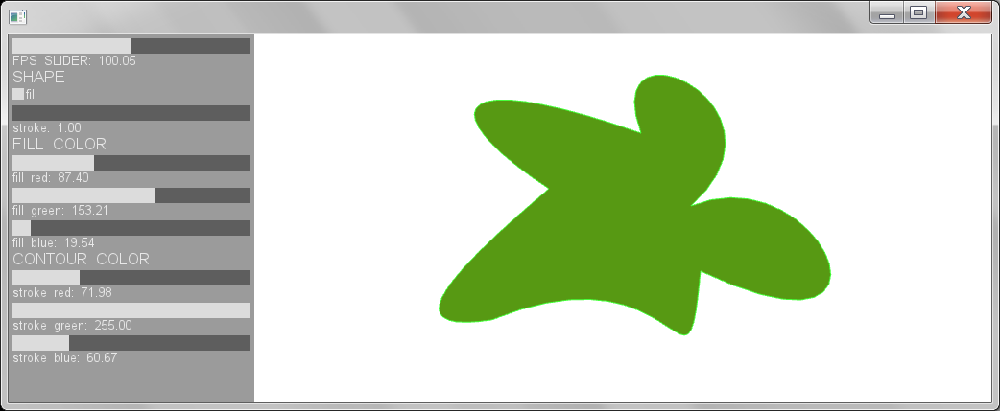
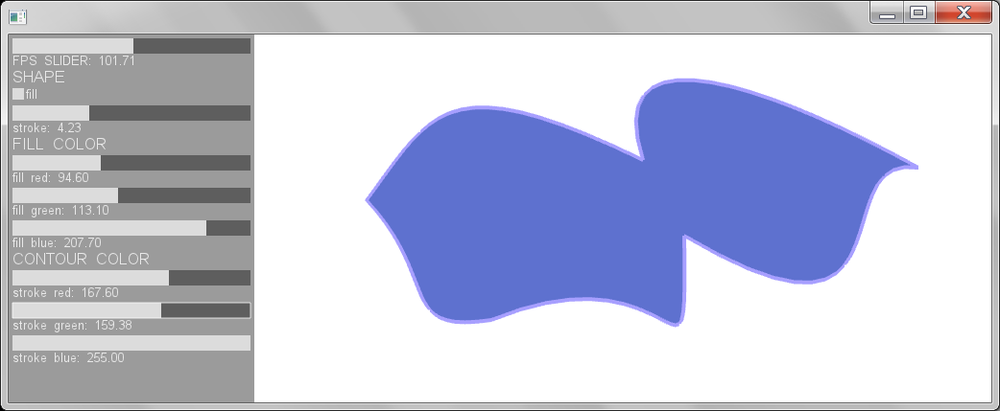
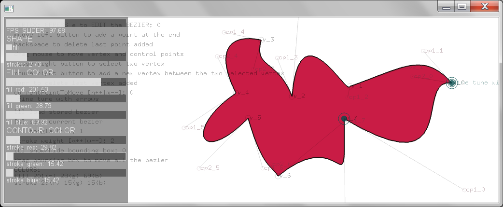

ofxBezierEditor
===============

An easy bézier shapes editor tool. Load, edit, save and draw bézier shapes in your Openframeworks aplication

Use
-------
Include the ofxBezierEditor and ofxXmlSettings addons to your project.
Check the example to include, create, load, save and draw your own shapes.

Change colors, stroke and stroke weight, vertex position and bézier's control points.
Create your own bézier convex shape:
* mouse left button to add a point at the end
* backspace to delete last point added
* drag mouse to move vertex and control points
* mouse right button to select two vertex
* mouse right button to add a new vertex between the two selected vertex
* supr to delete last vertex added
* drag bounding box to move all the bezier

Licence
-------
The code in this repository is available under the [MIT License](https://secure.wikimedia.org/wikipedia/en/wiki/Mit_license).  

Compatibility
------------
Tested with OF v08
Windows7 64 bits + CodeBlocks