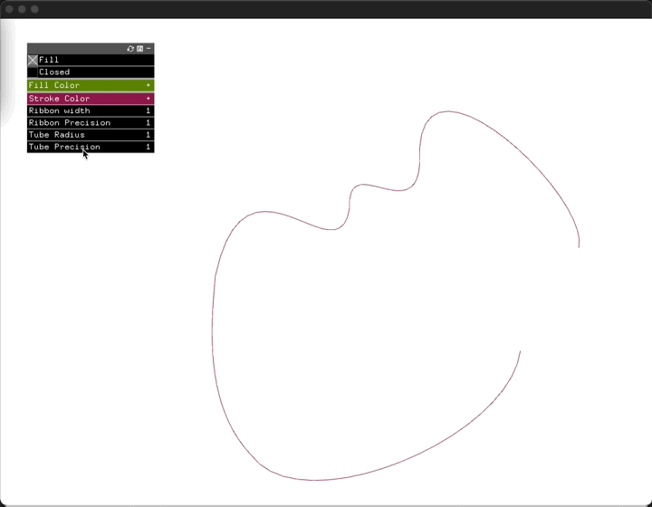

# ofxBezierEditor

An easy bézier shapes editor tool for OpenFrameworks. Load, edit, save, and draw bézier shapes in your OpenFrameworks application.

This addon was originally forked from [acarreras/ofxBezierEditor](https://github.com/acarreras/ofxBezierEditor) and has been updated to work with later versions of OpenGL. It now supports drawing fat lines and creating tube meshes tube mesh code courtesy of [julapy/ofxTubePrimitive](https://github.com/julapy/ofxTubePrimitive). The ofxUI dependency has been removed and replaced with ofxGui, the xml data format has been replaced with JSON.

## Usage

To use this addon, include the `ofxBezierEditor` addon in your project using the project generator. Refer to the provided example to learn how to include, create, load, save, and draw your own shapes.

You can customize your bézier convex shape using the following controls:
- Left mouse button: Add a point at the end
- Backspace: Delete the last added point
- Drag mouse: Move vertex and control points
- Right mouse button: Select two vertices
- Right mouse button (between two selected vertices): Add a new vertex
- Delete key (supr): Delete the last vertex added
- Drag the bounding box: Move all the points

## License

The code in this repository is available under the [MIT License](https://opensource.org/licenses/MIT).

## Compatibility

Tested with OpenFrameworks 0.12.0 on the following platforms:
- Windows 10 64-bit with Visual Studio
- macOS with Xcode
- This should work with any platform using the project generator.

